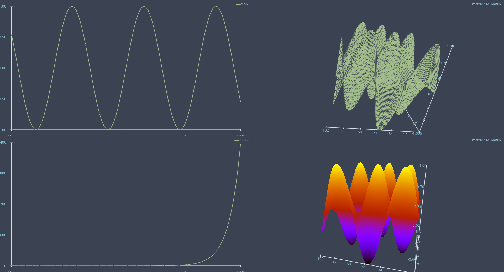

# Explot - exploratory data visualisation tool similar to gnuplopt 

Explot uses a command syntax similar to
[gnuplot](http://www.gnuplot.info/). The key difference is rendering
on the GPU (OpenGL right now) to allow interactive visualisation of
larger datasets.

**Note**: This is just a hobby project of mine and definitely not
ready for serious use.

## Usage

Start `explot` in a terminal and start plotting.

## Build

`explot` uses cmake as the build system and nix or vcpkg for dependency
management. 

### Linux

Use `nix develop --impure` to enter a development shell. Within this
shell you can use cmake to build `explot` as usual. `--impure` is
needed because OpenGL depends on the hardware. Unfortunately, that
also means that `explot` must be started via `nixGL explot` from the
development shell, unless you are using NixOS (I use Arch btw).

If you want to build `explot` without nix, you must make sure that
cmake can find all the dependencies. See `flake.nix` for a list of
dependencies.

### Windows

Under Windows, `explot` uses vcpkg for dependencies and the LLVM
toolchain for building. With Visual Studio you will need cmake
support, clang and vcpkg integration installed. You might also need to
point cmake to the vcpkg root like described here
https://learn.microsoft.com/en-us/vcpkg/users/buildsystems/cmake-integration.
Then `explot` should build and run as usually.

## Screenshots

### Plot example

### Splot example

### Hidden3d example

### Pm3d example

### Multiplot example

## Features

### Gnuplot featues

- [x] Basic commands `plot`, `splot`, `set` and `show`
- [x] Plotting text datafiles, as columns and as a matrix
- [x] Plotting functions and parametric curves/surfaces
- [x] Datetime handling
- [x] User-defined functions and variables
- [x] Multiplot Only simple layouts for now. Setting size and position
  manually for plots is not implemented yet.
- [ ] Load files
- [ ] Piped data
- [ ] Binary data
- Plotting styles:
  - [x] points
  - [x] lines
    - [x] dashed lines
  - [x] impulses (2d only)
  - [ ] filledcurve
  - [ ] boxes
  - [x] pm3d (only colored surface, no projection to top or bottom)
  - [x] hiddden3d
  - [ ] vectors
  - [ ] error bars
  
### Additional features

- [x] Pressing `q` closes plot window
- [ ] Parameters for expressions that can be changed
      interactively. They will probably use a syntax like `$p1`, `$p2`
      etc similar to columns.
- [ ] Time variable (e.g. `$t`) for expressions, so that plots can
      change over time.
- [ ] Color schemes. Right now the colors are taken from the [nord
      theme](https://www.nordtheme.com/). It would be nice to have
      named color schemes.

### Gnuplot features that are out-of-scope

- Creating images for publication. `gnuplot` is a great tool for
  that. `explot` is for interactive visualisation. In particluar,
  `explot` will never support `set output` unless the scope changes.
- Fitting data.
  
